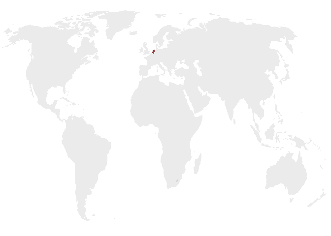

### Introduction
Since I am planning on using some gg_animate gifs for my thesis, it seemed like a good idea to start with a small project. This gif shows the countries I have visited thus far in order (or so I think, I haven't gone through the photo albums yet). A lot of the code was inspired by this [Github page](https://gist.github.com/rafapereirabr/0d68f7ccfc3af1680c4c8353cf9ab345#file-life_expect_world_map_gif-md). However, I did use the latest `gg_animate` grammar. Countries that I visited more than once, only show up the first time I visited them.

### Packages

These are the R packages I used:

```r
library(curl)
library(readxl)
library(data.table)
library(rworldmap)
library(ggplot2)
library(dplyr)
library(tweenr)
library(ggthemes)
library(rgeos)
library(countrycode)
library(gganimate)
library(knitr)
library(kableExtra)
```


### Data
I created an Excel file with all countries in the world, which can be easily found on the internet. I just used the file used in above-mentioned Github page and cleaned that. Then I added an extra column with the order of which I visited the countries. Maybe, if I feel like it, I will update it and also add dates/years later. This is how the data then looks likes:


```r
df <- read_excel(path= "countries_in order.xlsx", sheet=1)
df%>%
  head(13)%>%
  kable()%>%
  kable_styling(bootstrap_options =  c("striped", "hover", "condensed", "responsive"),
                full_width = F,
                position = "left")
```

<table class="table table-striped table-hover table-condensed table-responsive" style="width: auto !important; ">
 <thead>
  <tr>
   <th style="text-align:left;"> Country </th>
   <th style="text-align:right;"> visit </th>
  </tr>
 </thead>
<tbody>
  <tr>
   <td style="text-align:left;"> Burundi </td>
   <td style="text-align:right;"> NA </td>
  </tr>
  <tr>
   <td style="text-align:left;"> Comoros </td>
   <td style="text-align:right;"> NA </td>
  </tr>
  <tr>
   <td style="text-align:left;"> Djibouti </td>
   <td style="text-align:right;"> NA </td>
  </tr>
  <tr>
   <td style="text-align:left;"> Eritrea </td>
   <td style="text-align:right;"> NA </td>
  </tr>
  <tr>
   <td style="text-align:left;"> Ethiopia </td>
   <td style="text-align:right;"> NA </td>
  </tr>
  <tr>
   <td style="text-align:left;"> Kenya </td>
   <td style="text-align:right;"> 12 </td>
  </tr>
  <tr>
   <td style="text-align:left;"> Madagascar </td>
   <td style="text-align:right;"> NA </td>
  </tr>
  <tr>
   <td style="text-align:left;"> Malawi </td>
   <td style="text-align:right;"> NA </td>
  </tr>
  <tr>
   <td style="text-align:left;"> Mauritius </td>
   <td style="text-align:right;"> NA </td>
  </tr>
  <tr>
   <td style="text-align:left;"> Mayotte </td>
   <td style="text-align:right;"> NA </td>
  </tr>
  <tr>
   <td style="text-align:left;"> Mozambique </td>
   <td style="text-align:right;"> NA </td>
  </tr>
  <tr>
   <td style="text-align:left;"> Réunion </td>
   <td style="text-align:right;"> NA </td>
  </tr>
  <tr>
   <td style="text-align:left;"> Rwanda </td>
   <td style="text-align:right;"> 45 </td>
  </tr>
</tbody>
</table>

### Data manipulation

First we add the ISO3 code to the data

```r
setDT(df)
df[, country_iso3c := countrycode(Country, 'country.name', 'iso3c')]
```

Now we load the map and create the data.table we need for the polygon plotting in ggplot2.

```r
wmap <- getMap()
wmap <- spTransform(wmap, CRS("+proj=robin")) # reproject
wmap <-   subset(wmap, !(NAME %like% "Antar")) # Remove Antarctica
wmap_df <- fortify(wmap, region = "ISO3")
wmap_df <- left_join(wmap_df, df, by = c('id'='country_iso3c'))
```

In order to add a grey background, that is not influenced by the animation, I simply duplicated the data.table and added a postscript to the variable names.

```r
wmap_df2 <- wmap_df
colnames(wmap_df2) <- paste(colnames(wmap_df2), "2", sep = "_")
```


### Make the plot

```r
p <- ggplot() +
  geom_polygon(data = wmap_df, 
               aes(x = long,
                   y = lat,
                   group = group),
               fill="#800000")+
  geom_polygon(data = wmap_df2, # this is the background map, that is not influenced by the animated part of the gif
               aes(x = long_2,
                   y = lat_2,
                   group = group_2),
               fill="grey",
               alpha=.3)+
  theme_void() +
  coord_cartesian(xlim = c(-11807982, 14807978)) +
  transition_manual(visit)+
  shadow_trail(distance = 0.01, alpha=.4) # add a small number for distance, to make all visited countries show.
```

### Make and save the animation

This code is used to render and then save the GIF.

```r
animate(p, duration=30)
```

<!-- -->

```r
anim_save("countries_visited.gif", animation = p, duration =30)
```


